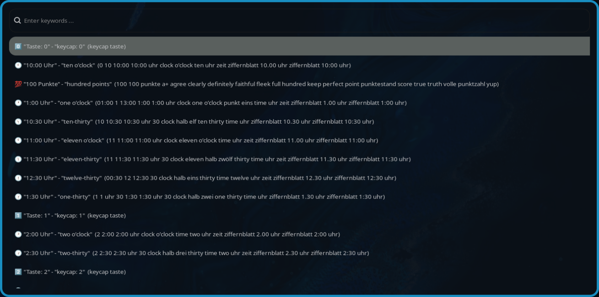

# wofi-emoji 🥞

Simple emoji selector for Wayland using [wofi](https://cloudninja.pw/docs/wofi.html) with localization support through [emojibase](https://github.com/milesj/emojibase).
It relies on [wtype](https://github.com/atx/wtype) to paste the emojis when it's supported, otherwise,
it just tries to copy it using [wl-clipboard](https://github.com/bugaevc/wl-clipboard) instead.

The original maintained repo can be found here: [Zeioth/wofi-emoji](https://github.com/Zeioth/wofi-emoji)

## Usage
```bash
Usage: wofi-emoji [OPTIONS]

OPTIONS:
    -l, --languages LANG1,LANG2    Specify languages to fetch (comma-separated)
                                   Available: en, de, es, fr, it, pt, ru, ja, ko, zh, etc.
                                   For full list see: https://emojibase.dev/emojis
                                   Default: en
    -f, --force                    Force refresh of cached database
    -h, --help                     Show this help message

Examples:
    wofi-emoji                    # Use English only (default)
    wofi-emoji -l en,de           # Use English and German
    wofi-emoji -l de,fr,es -f     # Use German, French, Spanish and force refresh db
```

### Example: `wofi-emoji -l de,en`

Searchable strings for emojis are output in this format "`Language 1 Description`" - "`Language 2 Description`" - ... (`Keywords for all the chosen languages`)



## Example Configuration for Sway and Hyprland

Download [wofi-emoji](https://github.com/BasicallyPolaris/wofi-emoji/raw/master/wofi-emoji), ensure it's executable and somewhere in your `$PATH`.

Add a shortcut key in your [sway](https://swaywm.org/) config:

```
# ~/.config/sway/config

bindsym Mod4+e exec wofi-emoji # -l en,de,fr,..
```

Or in your [Hyprland](https://wiki.hypr.land/) Config for Windows-Style emoji functionality:

```
# ~/.config/hypr/config/keybindings.conf

bindd = $mainMod, PERIOD, Emoji Picker, exec, wofi-emoji # -l en,de,fr,...
```
